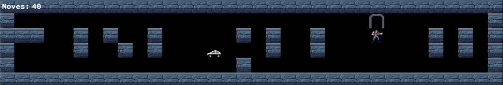

# so_long



## About the project

The so_Long project, a part of the curriculum at Hive (42 school), is a comprehensive introduction to 2D game development. This project leverages the Minilibx library to delve into the fundamentals of graphics programming, including the use of textures, sprites, and other basic gameplay elements.

### Game overview

The so_Long is a maze navigation game where the player's objective is to collect items while avoiding various obstacles. The ultimate goal is to reach the exit and secure a win.

### Game segments

#### Mandatory segment

In the mandatory segment, the player assumes the role of a thief whose primary mission is to gather coins scattered throughout the maze. The game is won when all coins are collected and the player successfully reaches the exit door.

#### Bonus segment

The bonus segment adds an extra layer of complexity. In addition to collecting coins and finding the exit, the player must also evade an enemy patrol, represented by a police car. The exit door in this stage is animated and only unlocks after all collectibles have been secured.

### Maze validation

The game employs the Floodfill algorithm to validate the maze's navigability. This ensures that there is always a feasible path for the player to collect all the items and reach the exit.

## Play the game

To run the game, first clone the repository and navigate into the project directory. Then, use the `make` command to compile the project.

Once the project is compiled, you can run it with the following command:

``` bash
./so_long <map.ber>
```

To compile the bonus part:
```bash
make bonus
```
Run the game:
```bash
./so_long <valid_map.ber>
```

### Maps

You will be able to play the game with any map, that follows the rules below:
* is a ``.ber`` file,
* only contains 1 -Wall, 0 - Empty space, C - Collectible, E - Exit, P - Player, and D - Enemy.
* is sorrounded by walls,
* has only one player, exit, and enemy (optional),
* and at least one collectible.

There are some valid maps, in the [`maps`](maps) directory!

### Controls
To move the player use the ``WASD`` keys. The player will move on all the directions, expect on through the walls.
